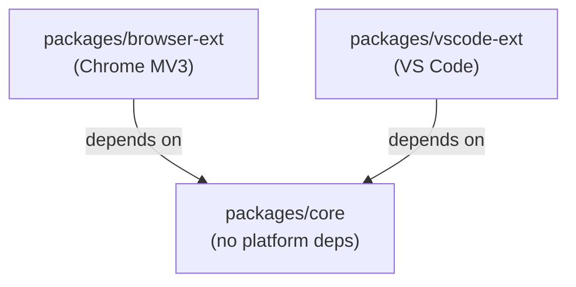
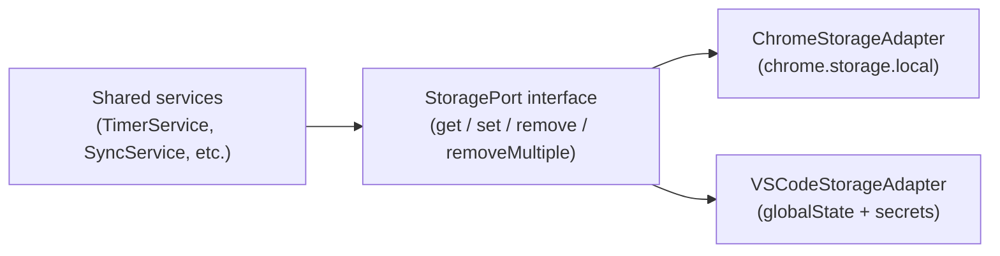
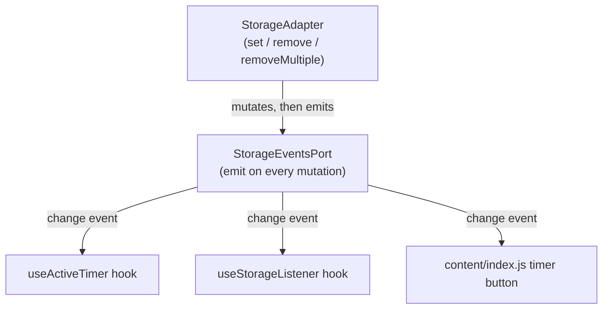
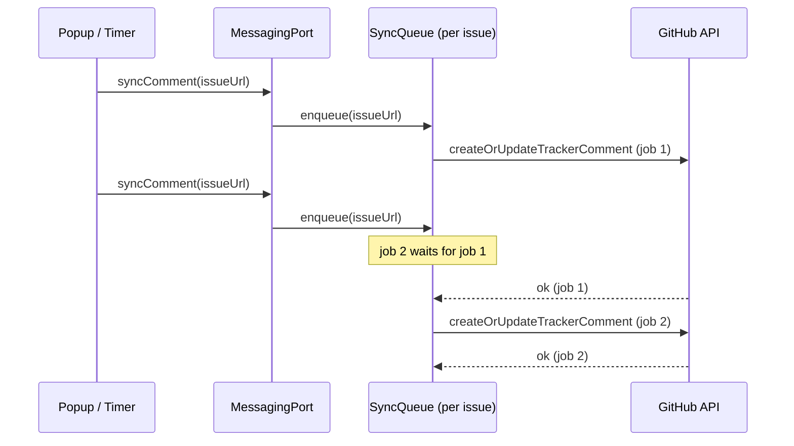
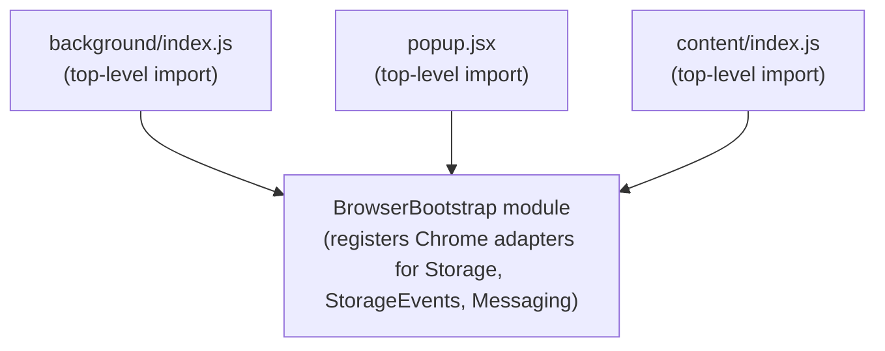
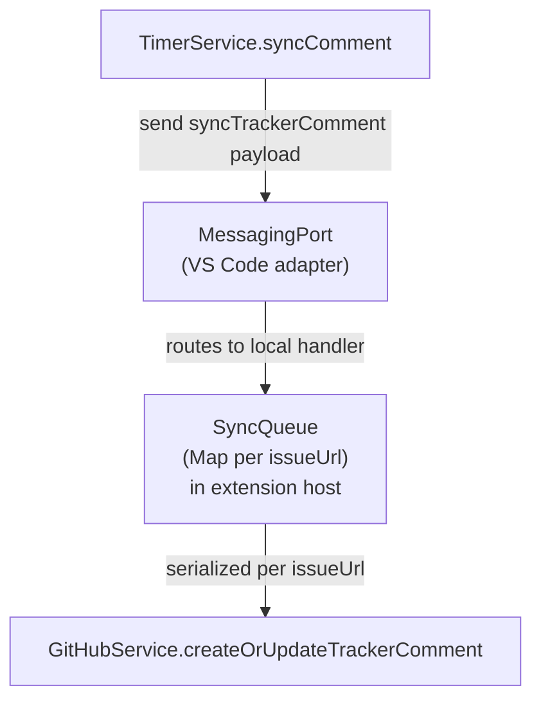
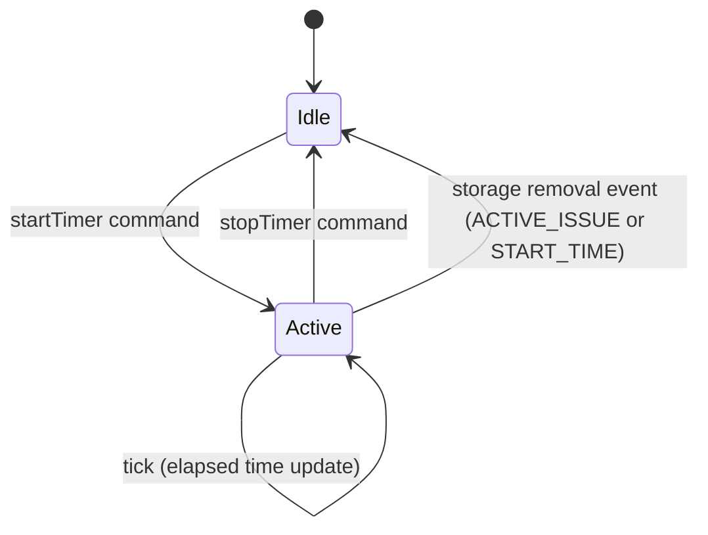
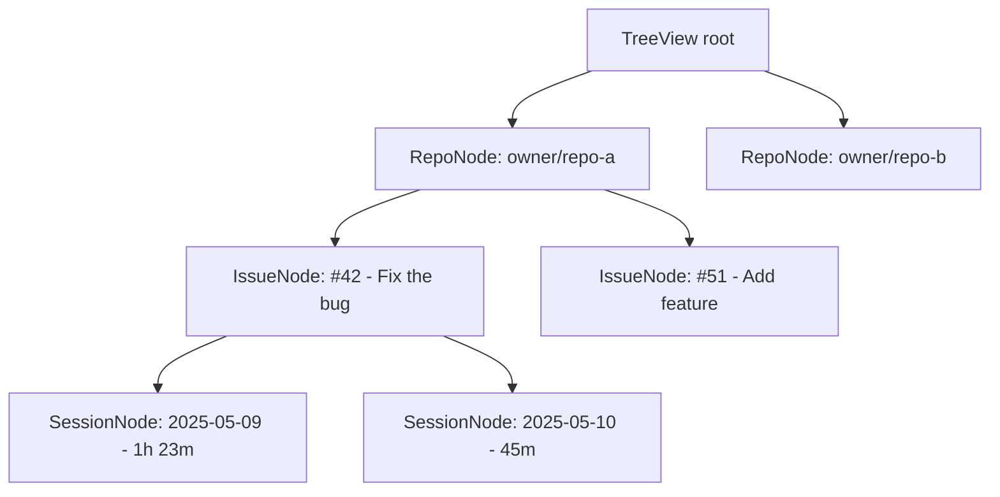
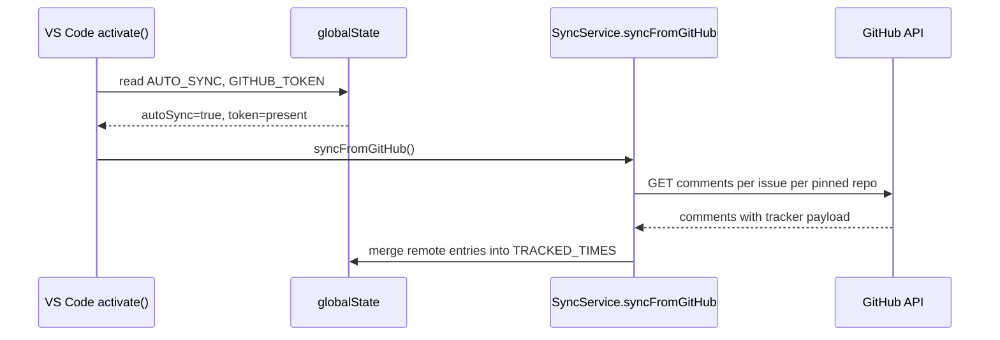

# VS Code Extension – Migration Plan

## Purpose

This document turns the architecture audit into a concrete execution plan.
It is organized as a set of milestones containing individually scoped implementation issues.
Each issue includes a textual explanation, relevant code references from the current codebase,
architecture diagrams where the wiring is non-obvious, and callout blocks for risks and invariants.

Use this document alongside `docs/vscode-extension-audit.md`.

---

## Goal

Ship OctoClock as a VS Code extension without regressing the existing Chrome extension.

Success means:

- the browser extension still passes the baseline smoke tests after shared-core extraction
- the VS Code extension can start and stop timers
- tracker-comment sync preserves the current ordering and recovery behavior
- the VS Code UX is primarily native (StatusBarItem, TreeView, commands)
- secrets, storage, and issue identity rules are handled explicitly at every seam

---

## Delivery strategy

Work in two tracks:

1. Stabilize and extract the shared core without changing browser behavior.
2. Build the VS Code extension on top of that extracted core.

Do not start building VS Code UI until the shared ports and browser bootstrap are proven stable.
That boundary is the main dependency constraint in this project.

---

## Milestones

| Milestone | Objective |
|-----------|-----------|
| 0 | Pre-migration baseline |
| 1 | Shared ports and browser-safe extraction |
| 2 | VS Code extension scaffold |
| 3 | Native timer UX |
| 4 | Repositories, issues, and sessions tree |
| 5 | Sync and recovery parity |
| 6 | Optional stats and settings polish |

---

## Issue 1 – Record current browser baseline

### What and why

Before any code moves, document the observable behavior of the current browser extension.
This creates a regression reference that every later milestone can check against.
Without it, regressions caused by refactoring are invisible until they affect real users.

The baseline must cover all three runtime contexts: the popup, the content script running on a
GitHub issue page, and the background service worker. Each context has distinct startup behavior and
communication paths.

### Flows to document

**Popup timer flow**

1. User opens the popup.
2. If AUTO_SYNC is enabled and a token is present, `syncFromGitHub` runs automatically.
   See `src/popup/App.jsx` lines 41-43:

```js
StorageService.get(STORAGE_KEYS.AUTO_SYNC).then((autoSync) => {
    if (autoSync) {
        syncFromGitHub().catch((e) => console.error('Auto-sync failed:', e));
    }
});
```

3. User selects an issue and clicks start. `TimerService.startTimer` writes `ACTIVE_ISSUE` and
   `START_TIME` to `chrome.storage.local`.
4. User clicks stop. `TimerService.stopTimer` appends a session to `TRACKED_TIMES`, removes
   `ACTIVE_ISSUE` and `START_TIME`, then fires tracker sync.

**Content-script timer flow**

1. Content script detects a GitHub issue page via `isIssuePage()`.
2. It polls for the issue metadata container and injects a timer button.
   See `src/content/index.js` lines 22-29.
3. The timer button calls `TimerService.startTimer`/`stopTimer` directly.
4. `chrome.storage.onChanged` is used to detect state changes and re-inject if the button is gone.
   See `src/content/index.js` lines 38-47.

**Sync flow**

1. `TimerService.stopTimer` calls `TimerService.syncComment` (a `chrome.runtime.sendMessage` call).
2. The background service worker receives the message and calls `queueTrackerCommentSync`.
   See `src/background/index.js` lines 83-116.
3. The queue serializes writes per issue to prevent concurrent tracker-comment corruption.

**Repo-pin auto-sync flow**

When a repo is pinned, `syncRepoFromGitHub` is called if AUTO_SYNC is enabled.
See `src/hooks/useIssuesData.js` lines 70-73.

### Acceptance criteria

- A manual regression checklist exists covering all four flows above.
- Validation steps are written as runnable instructions, not prose.
- This checklist is the reference for Gate A at the end of Milestone 1.

### Depends on

Nothing. This is the starting point.

---

## Issue 2 – Create monorepo package skeleton

### What and why

The current codebase is a single flat package. Shared services live alongside Chrome-specific code
with no enforced boundary. The monorepo split makes the boundary structural: code in `packages/core`
cannot import anything from `packages/browser-ext` or `packages/vscode-ext` because those packages
do not exist in its dependency tree.

The target structure is three packages under npm workspaces:



- `packages/core` contains services, utilities, and port interfaces. No `chrome.*` imports.
- `packages/browser-ext` contains browser adapters, entry points, and the Vite build config.
- `packages/vscode-ext` contains VS Code adapters, the extension entry point, and tree providers.

### Steps

1. Add a root `package.json` with `"workspaces": ["packages/*"]`.
2. Create `packages/core/package.json`, `packages/browser-ext/package.json`, and
   `packages/vscode-ext/package.json`.
3. Move existing Vite configs, `manifest.json`, and popup assets to `packages/browser-ext`.
4. Verify that `npm install` resolves all workspaces without errors.

> [!NOTE]
> Do not move service files yet. Just create the skeleton. Issue 7 performs the actual migration
> of service code once all ports are stable.

### Acceptance criteria

- `npm install` completes without errors.
- The browser extension build target has a clear path in `packages/browser-ext`.
- `packages/core` has no direct reference to any browser or VS Code API.

### Depends on

Issue 1

---

## Issue 3 – Introduce `StorageService` adapter port

### What and why

Every shared service currently imports `StorageService` directly, and `StorageService` calls
`chrome.storage.local` with no indirection.

Current state in `src/services/storage.service.js`:

```js
static async get(key) {
    const data = await chrome.storage.local.get(key);
    return data[key] ?? null;
}

static async set(key, value) {
    return chrome.storage.local.set({ [key]: value });
}

static async remove(key) {
    return chrome.storage.local.remove(key);
}

static async removeMultiple(keys) {
    return chrome.storage.local.remove(keys);
}
```

`removeMultiple` maps to the same `chrome.storage.local.remove` call as `remove`, but it is used
at different call sites. For example, `TimerService.stopTimer` calls `removeMultiple` for
`ACTIVE_ISSUE` and `START_TIME` simultaneously. The distinction matters for the storage-events
port in Issue 4.

### Target architecture



The shared services depend only on the port interface. The adapter is injected at startup by
each platform's bootstrap code.

### Steps

1. Define a `StoragePort` interface in `packages/core` with methods:
   `get(key)`, `set(key, value)`, `remove(key)`, `getMultiple(keys)`, `removeMultiple(keys)`.
2. Refactor `StorageService` to delegate to an injected adapter instead of calling
   `chrome.storage.local` directly.
3. Create `ChromeStorageAdapter` in `packages/browser-ext` implementing those methods.
4. Wire `ChromeStorageAdapter` as the default in the browser bootstrap (Issue 6 finalizes this).

> [!WARNING]
> The `removeMultiple` method must remain distinct from `remove` in the port contract.
> `TimerService.stopTimer` calls `removeMultiple([ACTIVE_ISSUE, START_TIME])` as a single
> atomic-equivalent operation. The storage-events adapter (Issue 4) must emit one compound event
> for that call, not two separate ones, or the active-timer teardown signal will fire twice.

### Acceptance criteria

- Shared services no longer contain any direct `chrome.storage.local` call.
- All existing storage operations still produce the same result in the browser build.
- The adapter is swappable at bootstrap time without modifying shared service code.

### Depends on

Issue 2

---

## Issue 4 – Introduce `StorageEventsPort`

### What and why

Three separate places in the current codebase listen to `chrome.storage.onChanged` directly:

1. `src/hooks/useActiveTimer.js` line 21 — reacts to `ACTIVE_ISSUE` and `START_TIME` changes,
   including when they are removed (`.newValue ?? null`):

```js
const listener = (changes, area) => {
    if (area !== 'local') return;
    if (changes[STORAGE_KEYS.ACTIVE_ISSUE]) {
        setActiveIssue(changes[STORAGE_KEYS.ACTIVE_ISSUE].newValue ?? null);
    }
    if (changes[STORAGE_KEYS.START_TIME]) {
        setStartTime(changes[STORAGE_KEYS.START_TIME].newValue ?? null);
    }
};
chrome.storage.onChanged.addListener(listener);
```

2. `src/hooks/useStorageListener.js` line 18 — generic key watcher.
3. `src/content/index.js` line 38 — re-injects the timer button when timer state changes.

In VS Code there is no `chrome.storage.onChanged`. The storage-events port replaces that API
with a platform-neutral event emitter that any adapter can drive.

### Event types that must be emitted

The port must emit events for all three mutation operations:

| StorageService method | Event type |
|----------------------|------------|
| `set(key, value)` | `{ type: 'set', key, value }` |
| `remove(key)` | `{ type: 'remove', key }` |
| `removeMultiple(keys)` | `{ type: 'removeMultiple', keys }` |

> [!IMPORTANT]
> `TimerService.stopTimer` calls `StorageService.removeMultiple([ACTIVE_ISSUE, START_TIME])`.
> If the events port only emits on `set`, the active timer UI state will never clear after stop.
> This is the most likely silent regression during the port extraction.

### Target wiring



### Steps

1. Define a `StorageEventsPort` in `packages/core` with `on(handler)` and `off(handler)` methods.
2. Have the `StorageAdapter` emit through the port after every `set`, `remove`, and `removeMultiple`.
3. Replace `chrome.storage.onChanged.addListener` in `useActiveTimer.js` and `useStorageListener.js`
   with the port's `on` method.
4. The browser adapter can implement the port by wrapping `chrome.storage.onChanged` directly.
5. The VS Code adapter will implement the port with a simple in-process event emitter.

### Acceptance criteria

- No portable hook or service contains `chrome.storage.onChanged`.
- Stopping a timer (which calls `removeMultiple`) correctly clears `activeIssue` and `startTime`
  in the UI.
- Starting and stopping a timer in sequence does not leave stale state in any listener.

### Depends on

Issue 3

---

## Issue 5 – Introduce `MessagingPort` and preserve sync queue abstraction

### What and why

`TimerService` sends three direct `chrome.runtime.sendMessage` calls:

| Method | Line | Message action |
|--------|------|----------------|
| `syncComment` | line 58 | `syncTrackerComment` |
| `startTimer` | line 182 | `timerStarted` |
| `stopTimer` | line 127 | `timerStopped` |

In `src/services/timer.service.js` lines 54-85, `syncComment` is a Promise-wrapped
`chrome.runtime.sendMessage` call that routes to the background service worker. The background
worker receives the message and calls `queueTrackerCommentSync`, which serializes writes per issue
using a `Map` of promise chains.

Current state in `src/background/index.js` lines 9-10 and 83-116:

```js
const trackerSyncQueues = new Map();

function queueTrackerCommentSync(payload) {
    const previous = trackerSyncQueues.get(payload.issueUrl) ?? Promise.resolve();
    const next = previous
        .catch(...)
        .then(() => syncTrackerComment(payload));
    trackerSyncQueues.set(payload.issueUrl, next);
    return next;
}
```

This queue is the mechanism that prevents concurrent tracker-comment writes from corrupting each
other when the user stops, edits, or deletes sessions in rapid succession.

### Why the queue must be preserved



If the queue is replaced with direct concurrent calls, a second sync can overwrite the first
before it completes, producing an incorrect tracker comment.

### Steps

1. Define a `MessagingPort` in `packages/core` with a `send(action, payload)` method that
   returns a Promise.
2. Replace the three direct `chrome.runtime.sendMessage` calls in `timer.service.js` with
   `MessagingPort.send(...)`.
3. Create a `ChromeMessagingAdapter` in `packages/browser-ext` that wraps
   `chrome.runtime.sendMessage`.
4. The VS Code adapter will route `syncTrackerComment` messages directly to a local queue handler
   (Issue 11) rather than through inter-process messaging.

> [!WARNING]
> The VS Code extension host is a persistent Node.js process, not a service worker.
> It can call `syncTrackerComment` directly without inter-process messaging. However, the
> per-issue queue must still exist in the VS Code extension host. Do not skip the queue
> just because the process is always running — rapid session mutations still race without it.

> [!NOTE]
> The `timerStarted` and `timerStopped` messages in `startTimer` and `stopTimer` (lines 182, 127)
> exist to forward events to GitHub tabs. In VS Code those have no browser-tab equivalent.
> The VS Code adapter can no-op those actions or route them to an internal event bus.

### Acceptance criteria

- `timer.service.js` contains no direct `chrome.runtime.sendMessage` call.
- The browser extension still forwards `timerStarted`/`timerStopped` to GitHub tabs.
- Tracker sync still serializes writes per issue in both browser and VS Code paths.

### Depends on

Issue 3

---

## Issue 6 – Wire browser bootstrap in all three entry points

### What and why

The browser extension runs in three separate JavaScript contexts, each with its own initialization
lifecycle:

| Context | Entry point | Startup trigger |
|---------|-------------|-----------------|
| Background service worker | `src/background/index.js` | Chrome wakes the SW |
| Popup | `popup.jsx` | User opens the popup |
| Content script | `src/content/index.js` | Page load on a GitHub issue page |

After Issues 3, 4, and 5 are complete, shared services depend on injected adapters.
If any context starts using a service before the adapter is registered, the call fails at runtime.
Each context must run the same bootstrap before any service call.

### Bootstrap wiring



The bootstrap module is a shared import that registers the three Chrome adapters. It must be
imported at the very top of each entry-point file, before any service is used.

### Steps

1. Create `packages/browser-ext/bootstrap.js` that registers `ChromeStorageAdapter`,
   `ChromeStorageEventsAdapter`, and `ChromeMessagingAdapter`.
2. Add `import './bootstrap.js'` as the first import in `background/index.js`.
3. Add the same import as the first import in `popup.jsx`.
4. Add the same import as the first import in `content/index.js`.
5. Run all three browser entry points and confirm no runtime failures.

> [!IMPORTANT]
> Missing the bootstrap in one entry point is a silent failure at runtime, not a build failure.
> The content script is the most frequently missed because it is initialized separately from the
> popup. Verify all three contexts explicitly.

> [!NOTE]
> The content script does not use the messaging port for outbound sync calls — it calls
> `TimerService` directly, which uses the messaging port internally. The content bootstrap
> only needs to register the storage adapter and storage-events adapter.

### Acceptance criteria

- All three browser contexts start without runtime exceptions.
- Popup timer start/stop still works.
- Content-script timer button still works.
- Tracker sync still reaches the background service worker.

### Depends on

Issue 3, Issue 4, Issue 5

---

## Issue 7 – Move shared services and utilities into `packages/core`

### What and why

With all three ports extracted and the browser bootstrap wired, the shared service code no longer
contains any direct browser API call. It is safe to move it to `packages/core`.

Services to move:

- `TimerService` (`src/services/timer.service.js`)
- `GitHubService` (`src/services/github.service.js`)
- `GitHubStorageService` (`src/services/github-storage.service.js`)
- `IssueStorageService` (`src/services/issue-storage.service.js`)
- `PinnedReposService` (`src/services/pinned-repos.service.js`)
- `CacheService` (`src/services/cache.service.js`)
- `SyncService` (`src/services/sync.service.js`)
- `EveryoneDataService` (`src/services/everyone-data.service.js`)

Utilities to move:

- `src/utils/constants.utils.js`
- `src/utils/time.utils.js`
- `src/utils/aggregation.utils.js`
- `src/utils/schema.utils.js`

Hooks and UI components stay in `packages/browser-ext` or are reimplemented in `packages/vscode-ext`.
They contain platform-specific rendering logic.

> [!NOTE]
> `StorageService` itself moves to `packages/core` as the port-delegating class. The adapter
> implementations (`ChromeStorageAdapter`, etc.) stay in `packages/browser-ext`.

### Steps

1. Copy services and utils into `packages/core/src/`.
2. Update all internal imports to use package-relative paths.
3. Update `packages/browser-ext` imports to reference `@octoclock/core`.
4. Run the browser build and confirm it succeeds.
5. Run the browser baseline checklist from Issue 1.

### Acceptance criteria

- Browser extension builds successfully from the new package structure.
- No service in `packages/core` imports from `chrome.*`, `vscode`, or any browser/VS Code global.
- Browser baseline smoke tests pass.

### Depends on

Issue 4, Issue 5, Issue 6

---

## Issue 8 – Gate A – Verify browser parity before any VS Code work

### What and why

This is a mandatory validation gate. No VS Code code should be written until this gate passes.
The shared-core extraction has changed the architecture of the browser extension; undetected
regressions at this stage will compound as VS Code work begins.

### Checklist

Run the browser regression checklist from Issue 1 against the new package structure.

Required flows:

| Flow | Expected result |
|------|-----------------|
| Popup: start timer | `ACTIVE_ISSUE` and `START_TIME` written to storage |
| Popup: stop timer | Session appended to `TRACKED_TIMES`, keys removed |
| Popup: auto-sync on open | `syncFromGitHub` runs when AUTO_SYNC is enabled |
| Content script: inject button | Timer button appears on a GitHub issue page |
| Content script: start/stop timer | Same storage behavior as popup |
| Tracker sync | Tracker comment created or updated on GitHub |
| Repo pin: auto-sync | `syncRepoFromGitHub` runs when AUTO_SYNC is enabled |
| Session delete | Session removed from `TRACKED_TIMES`, tracker sync fires |
| Session edit | Session updated in `TRACKED_TIMES`, tracker sync fires |

> [!IMPORTANT]
> If any row fails, fix it before proceeding. The VS Code work in Issues 9 onward assumes that
> shared core services are correct. A broken shared core will produce two failure surfaces
> instead of one.

### Acceptance criteria

- All rows in the table above pass manual verification.
- No console errors appear in popup, background, or content script contexts.

### Depends on

Issue 7

---

## Issue 9 – Scaffold the VS Code extension package

### What and why

The VS Code extension needs its own `package.json` with the correct VS Code engine declaration,
an extension manifest (`contributes` block), and an activation entry point. This issue creates
that scaffold so subsequent issues have a place to add their implementations.

Key decisions at scaffold time:

- `extensionKind` should be set to `["workspace"]` so that in remote-host scenarios (SSH, Dev
  Containers), the extension runs on the same host as the Git repository. Storage will then live
  with the workspace rather than the UI layer.
- The initial `activationEvents` can be `["onStartupFinished"]` to activate lazily.
- The entry point exports an `activate(context)` function that will grow with each issue.

> [!NOTE]
> VS Code extension packaging uses `@vscode/vsce`. The extension's `main` field must
> point to the compiled output. Vite or esbuild can be configured in `packages/vscode-ext`.

### Acceptance criteria

- Running the extension in the VS Code Extension Development Host does not throw activation errors.
- `context.globalState` and `context.secrets` are accessible in `activate`.
- The extension appears in the Extensions view with the correct name and version.

### Depends on

Issue 7

---

## Issue 10 – Implement VS Code storage and secrets adapters

### What and why

VS Code provides two distinct storage mechanisms that map to the two categories of data in OctoClock:

| Data category | Browser storage | VS Code storage |
|---------------|----------------|-----------------|
| GitHub token | `chrome.storage.local` (GITHUB_TOKEN key) | `context.secrets` |
| Timer state and tracked times | `chrome.storage.local` | `context.globalState` |
| Cached issues, user, comment IDs | `chrome.storage.local` | `context.globalState` |

The `GitHubStorageService` currently stores the token via `StorageService.set(STORAGE_KEYS.GITHUB_TOKEN, token)`.
In VS Code that key must be redirected to `context.secrets.store(...)` instead of `globalState`.

The adapter can inspect the key to decide which backing store to use:

```js
// VSCodeStorageAdapter (sketch)
set(key, value) {
    if (key === STORAGE_KEYS.GITHUB_TOKEN) {
        return this.secrets.store(key, JSON.stringify(value));
    }
    return this.globalState.update(key, value);
}

get(key) {
    if (key === STORAGE_KEYS.GITHUB_TOKEN) {
        return this.secrets.get(key).then((v) => (v ? JSON.parse(v) : null));
    }
    return Promise.resolve(this.globalState.get(key) ?? null);
}
```

> [!WARNING]
> The `GITHUB_TOKEN_PATTERN` regex in `src/services/github-storage.service.js` line 4 validates
> token format on both input and read-back. Keep this validation. The regex is a data-integrity
> check, not a security mechanism. Moving the token to `context.secrets` (OS keychain) improves
> confidentiality; it does not eliminate the need for format validation.

> [!NOTE]
> `context.globalState` is scoped to the workspace folder by default when `extensionKind` is
> `"workspace"`. If the user has multiple workspace folders open, data is shared across them
> within that VS Code window. This matches the browser extension behavior where all data is in
> a single `chrome.storage.local` namespace.

### Acceptance criteria

- `StorageService.get(STORAGE_KEYS.GITHUB_TOKEN)` reads from `context.secrets` in the VS Code build.
- `StorageService.set(STORAGE_KEYS.GITHUB_TOKEN, token)` writes to `context.secrets`.
- All other keys read from and write to `context.globalState`.
- Token format validation still runs on set and on read-back.

### Depends on

Issue 9

---

## Issue 11 – Implement queued sync handler in the extension host

### What and why

In the browser extension, `TimerService.syncComment` sends a `chrome.runtime.sendMessage` to the
background service worker, which then calls `queueTrackerCommentSync`. The queue serializes
writes per issue using a `Map` of promise chains (see `src/background/index.js` lines 9, 83-116).

In VS Code, there is no background service worker and no inter-process messaging for this path.
The `MessagingPort` VS Code adapter routes `syncTrackerComment` messages to a local handler in
the extension host. That handler must replicate the queue.

### Wiring



### Steps

1. Create `VSCodeMessagingAdapter` in `packages/vscode-ext`.
2. For the `syncTrackerComment` action, call a local `queueTrackerCommentSync` function that
   mirrors the logic in `src/background/index.js` lines 83-116.
3. For `timerStarted` and `timerStopped` actions, fire an internal VS Code event or no-op.
4. Register the adapter in the VS Code bootstrap (wired in `activate`).

> [!WARNING]
> Do not skip the per-issue queue just because the extension host is always running.
> The user can stop a timer, immediately edit the session, and immediately delete it.
> Each of those operations calls `syncComment`. Without the queue, the second and third
> calls can overwrite the first before it completes, producing an incorrect tracker comment.

### Acceptance criteria

- Rapid stop, edit, and delete sequences do not produce out-of-order tracker-comment writes.
- The `syncTrackerComment` path works end-to-end: session data is read from `globalState` and
  the comment is created or updated on GitHub.

### Depends on

Issue 10

---

## Issue 12 – Register VS Code commands for start, stop, and sync

### What and why

VS Code commands are the primary interaction point for users who do not use the tree view or
status bar yet. Commands are also required before any UI can trigger timer operations.

Commands to register in the `contributes.commands` block:

| Command ID | Title |
|-----------|-------|
| `octoclock.startTimer` | Start timer for issue |
| `octoclock.stopTimer` | Stop current timer |
| `octoclock.syncNow` | Sync tracker comments now |

The `startTimer` command needs an issue URL argument. In the first iteration it can prompt the
user for a URL via `vscode.window.showInputBox`. Later iterations can integrate with the tree view.

> [!NOTE]
> The issue URL must conform to the `/owner/repo/issues/123` format enforced by
> `GitHubService.parseIssueUrl` in `src/services/github.service.js` line 20:
>
> ```js
> const match = url.match(/^\/([^/]+)\/([^/]+)\/issues\/(\d+)/);
> ```
>
> Normalize any full URL the user pastes at the command boundary before passing it to
> shared services.

### Acceptance criteria

- All three commands appear in the command palette.
- `startTimer` writes `ACTIVE_ISSUE` and `START_TIME` to `globalState`.
- `stopTimer` appends a session to `TRACKED_TIMES` and removes the active-timer keys.
- `syncNow` triggers a tracker-comment sync through the queued handler.

### Depends on

Issue 10, Issue 11

---

## Issue 13 – Build the status bar timer display

### What and why

The status bar is the most lightweight native timer UX. It shows the current timer state
without requiring the user to open any panel. When no timer is active it shows an idle label;
when active it shows elapsed time and a stop action.

### State machine



The status bar must react to storage removal events — not just explicit stop commands — because
the `TimerService.stopTimer` path calls `StorageService.removeMultiple([ACTIVE_ISSUE, START_TIME])`,
which triggers the storage-events port. If the status bar only listens to the stop command it
will miss error-path cleanups where keys are removed directly.

See `src/hooks/useActiveTimer.js` lines 22-31 for how the browser UI handles this:

```js
if (changes[STORAGE_KEYS.ACTIVE_ISSUE]) {
    setActiveIssue(changes[STORAGE_KEYS.ACTIVE_ISSUE].newValue ?? null);
}
if (changes[STORAGE_KEYS.START_TIME]) {
    setStartTime(changes[STORAGE_KEYS.START_TIME].newValue ?? null);
}
```

The `newValue ?? null` pattern handles both set and removal (where `newValue` is `undefined`).

### Steps

1. Create a `StatusBarItem` in `activate` with `vscode.window.createStatusBarItem`.
2. Subscribe to the `StorageEventsPort` for changes to `ACTIVE_ISSUE` and `START_TIME`.
3. On a set event, update the label to show the active issue and start an interval timer.
4. On a remove event (for either key), clear the label and stop the interval.
5. Set the status bar item's command to `octoclock.stopTimer`.

### Acceptance criteria

- Status bar shows idle state when no timer is running.
- Status bar shows the active issue and elapsed time when a timer is running.
- Stopping the timer via any path (command, tree action, or direct storage removal) clears
  the status bar.

### Depends on

Issue 12

---

## Issue 14 – Build the repo and issue tree view

### What and why

The tree view exposes the pinned repos, issues, and session data in a native VS Code panel.
It is the primary navigation surface for the VS Code extension.

### Node hierarchy



Each `IssueNode` shows the total tracked time for that issue. Each `SessionNode` shows the date
and duration of a single entry from `TRACKED_TIMES`.

### Issue identifier invariant

The issue URL stored in `TRACKED_TIMES` entries uses the relative path format
`/owner/repo/issues/123`. This is enforced by `GitHubService.simplifyIssue` in
`src/services/github.service.js` lines 31-40. The tree view must use this format when constructing
issue nodes and when passing URLs to commands.

> [!WARNING]
> Do not construct issue URLs from the `TreeItem` label or any display string.
> Use the `issueUrl` field from the stored `TrackedTimeEntry` directly. Reconstructing
> the URL from display text risks format drift and will break `GitHubService.parseIssueUrl`.

### Steps

1. Implement `RepoTreeProvider` extending `vscode.TreeDataProvider`.
2. Implement node classes: `RepoNode`, `IssueNode`, `SessionNode`.
3. Aggregate session data per issue using the existing aggregation utilities in
   `src/utils/aggregation.utils.js` (once moved to `packages/core`).
4. Subscribe to `StorageEventsPort` to refresh the tree when `TRACKED_TIMES` or `PINNED_REPOS` changes.
5. Register the tree view in `activate` with `vscode.window.createTreeView`.

### Acceptance criteria

- Pinned repos, issues, and sessions render correctly.
- Total tracked time per issue is accurate.
- The tree refreshes when sessions are added or removed.
- Issue identifiers match the `/owner/repo/issues/123` format throughout.

### Depends on

Issue 10, Issue 12

---

## Issue 15 – Add session edit and delete actions

### What and why

`TimerService.deleteSession` and `TimerService.updateSessionTime` are the shared service methods
for session mutation. Both read and write `TRACKED_TIMES` in storage and call `syncComment`
afterward to update the tracker comment on GitHub.

These actions must be exposed from the tree view `SessionNode` items via context menu commands.
The mutations must go through `TimerService` so that the sync queue is invoked correctly.

> [!NOTE]
> Session identity in the current schema uses a combination of `issueUrl`, `date`, and `seconds`
> to locate the entry. `TimerService.deleteSession` finds the entry by matching
> `e.issueUrl === issueUrl && e.date === date && e.seconds === seconds`.
> This is a positional match, not a unique ID. If two sessions for the same issue on the same
> date have the same duration, the first match is deleted. Accept this behavior as-is for now;
> a unique session ID would require a schema migration.

### Steps

1. Add `octoclock.deleteSession` and `octoclock.editSession` commands to the manifest.
2. Wire context menu items on `SessionNode` in the tree view.
3. `deleteSession`: call `TimerService.deleteSession(issueUrl, date, seconds)`.
4. `editSession`: prompt for a new duration with `vscode.window.showInputBox`, parse seconds,
   call `TimerService.updateSessionTime(issueUrl, date, seconds, newSeconds)`.
5. Refresh the tree after each mutation via the `StorageEventsPort` change event on `TRACKED_TIMES`.

### Acceptance criteria

- Deleting a session removes it from the tree and from `TRACKED_TIMES` in storage.
- Editing a session updates the displayed duration and persisted data.
- A tracker-comment sync fires after each mutation.
- Rapid mutations do not produce out-of-order tracker-comment writes.

### Depends on

Issue 11, Issue 14

---

## Issue 16 – Restore recovery and auto-sync parity

### What and why

The browser extension has two recovery entry points that re-read tracked time from GitHub
and merge it into local storage:

1. On popup open — when `AUTO_SYNC` is enabled and a token exists, `syncFromGitHub` runs.
   See `src/popup/App.jsx` lines 41-43.
2. On repo pin — `syncRepoFromGitHub` runs when `AUTO_SYNC` is enabled.
   See `src/hooks/useIssuesData.js` lines 70-73.

The VS Code extension must replicate both recovery paths so that data is not lost when a user
installs the VS Code extension after using the browser extension, or when they use both.

### Recovery flow



### Steps

1. In `activate`, after storage adapter is registered, read `AUTO_SYNC` and `GITHUB_TOKEN`.
2. If both are present, call `syncFromGitHub()` from `SyncService` in a non-blocking fire-and-forget.
3. Add a `pinRepo` flow in the tree view that calls `syncRepoFromGitHub` when `AUTO_SYNC` is enabled.
4. Expose a pin/unpin command that triggers the same auto-sync behavior as the browser extension.

> [!NOTE]
> Recovery can take several seconds per repo when there are many issues.
> Run it non-blocking (fire-and-forget with error logging) so that activation does not time out.
> VS Code will terminate the activation function if it does not resolve quickly.

### Acceptance criteria

- On extension activation with `AUTO_SYNC` enabled, `syncFromGitHub` runs.
- Pinning a repo triggers `syncRepoFromGitHub` when `AUTO_SYNC` is enabled.
- Recovery errors are logged but do not prevent the extension from activating.
- Manual sync via `octoclock.syncNow` still works independently of auto-sync.

### Depends on

Issue 11, Issue 14

---

## Issue 17 – Optional stats and settings UX

### What and why

Stats and settings require a richer surface than a tree view or status bar can provide alone.
A webview panel can render the existing chart and calendar components, but it introduces
maintenance cost. This issue is optional — implement it only after the core timer workflow
is stable and validated.

Settings to expose:

- AUTO_SYNC toggle (non-secret, stored in `globalState`)
- GitHub token input (secret, stored in `context.secrets`)
- Theme preference (non-secret, stored in `globalState`)

> [!NOTE]
> VS Code provides a built-in settings UI via `contributes.configuration`. For simple boolean
> and string settings that are not sensitive, prefer `contributes.configuration` over a webview.
> Reserve the webview for the stats/calendar visualization only.

> [!WARNING]
> Never expose the GitHub token through `contributes.configuration`. Configuration values are
> stored in plain-text settings files. The token must go through `context.secrets` only.
> Provide a dedicated command (for example `octoclock.setToken`) that calls `context.secrets.store`.

### Acceptance criteria

- AUTO_SYNC and theme can be toggled through VS Code settings.
- Token is set and cleared through dedicated commands, not through the settings file.
- Stats/calendar panel is optional and renders correctly if implemented.

### Depends on

Issue 13, Issue 14, Issue 16

---

## Execution order

Follow this sequence strictly. Each step depends on all prior steps being complete and passing.

1. Record browser baseline and smoke tests. (Issue 1)
2. Create workspace package skeleton. (Issue 2)
3. Extract storage behind an adapter port. (Issue 3)
4. Extract storage change events behind a port. (Issue 4)
5. Extract messaging and ordered sync behind a port. (Issue 5)
6. Wire browser bootstrap in all three entry points. (Issue 6)
7. Move shared services and utilities into `packages/core`. (Issue 7)
8. Run Gate A browser parity verification. (Issue 8)
9. Scaffold the VS Code extension package. (Issue 9)
10. Implement VS Code storage and secrets adapters. (Issue 10)
11. Implement queued sync handler in the extension host. (Issue 11)
12. Register commands and confirm timer start/stop. (Issue 12)
13. Build the status bar timer display. (Issue 13)
14. Build the repo and issue tree view. (Issue 14)
15. Add session edit and delete actions. (Issue 15)
16. Restore recovery and auto-sync parity. (Issue 16)
17. Add optional stats and settings polish when the core workflow is stable. (Issue 17)

> [!IMPORTANT]
> If the browser parity gate (Issue 8) fails, stop all VS Code work and fix the regression first.
> A broken shared core produces two failure surfaces and makes root-cause analysis much harder.

---

## Validation gates

### Gate A – Browser parity

Run after Issue 8.

Required flows to verify manually:

- Popup: timer start and stop
- Popup: auto-sync on open
- Content script: timer button injection
- Content script: timer start and stop
- Tracker sync on stop
- Session edit and delete with sync
- Repo pin with auto-sync

Pass condition: no behavioral difference from the baseline recorded in Issue 1.

### Gate B – VS Code activation

Run after Issue 12.

Required verifications:

- Extension activates without errors in the Extension Development Host.
- `globalState` reads and writes succeed.
- `context.secrets` read and write succeed for the token key.
- Commands execute from the command palette.

### Gate C – Native timer UX

Run after Issue 13.

Required verifications:

- Status bar shows idle state.
- Status bar shows active issue and elapsed time when a timer runs.
- Stopping the timer via command clears the status bar.
- Stopping the timer via direct storage removal (error path) also clears the status bar.

### Gate D – Tree workflow

Run after Issue 15.

Required verifications:

- Pinned repos appear in the tree view.
- Issues and sessions render under each repo.
- Editing a session updates the tree and the stored data.
- Deleting a session updates the tree and fires a tracker sync.

### Gate E – Sync parity

Run after Issue 16.

Required verifications:

- Recovery runs on activation when AUTO_SYNC is enabled.
- Repo-pin recovery runs when AUTO_SYNC is enabled.
- Rapid stop, edit, delete sequences do not produce out-of-order tracker comments.
- Manual sync via command still works.

---

## Known risks

### Risk 1 – Browser bootstrap regression

A missing adapter import in one of the three browser entry points (background, popup, content)
will not fail at build time. It fails silently at runtime. Use an explicit shared bootstrap
module imported as the first statement in each entry point.

### Risk 2 – Incomplete storage removal events

If the `StorageEventsPort` emits only on `set` and not on `remove` and `removeMultiple`, the
active-timer state will never clear in the UI after `TimerService.stopTimer` runs.
Test start, stop, and error-path cleanup explicitly. See Issue 4 for the full event type table.

### Risk 3 – Tracker comment race conditions

The per-issue sync queue in `src/background/index.js` prevents concurrent writes from corrupting
tracker comments. This queue must exist in the VS Code extension host as well. The extension host
being a persistent process does not eliminate the race — rapid user actions still race without it.
See Issue 11.

### Risk 4 – Token in wrong storage tier

The GitHub token must go to `context.secrets`, not `globalState`. Mixing them exposes the token
in plain-text workspace settings. See Issue 10.

### Risk 5 – Remote-host storage placement

With `extensionKind: ["workspace"]`, storage lives on the remote host when using SSH or Dev
Containers. This means the token stored in `context.secrets` lives on the remote machine's
OS keychain. Decide early whether this is the intended behavior for your user base.

### Risk 6 – Issue identifier drift

All shared services assume issue URLs in `/owner/repo/issues/123` format. Any VS Code UI that
constructs or accepts issue URLs must normalize at the boundary. Do not reconstruct the URL from
display strings. See Issue 14.

---

## Deliverable checklist

- [ ] Browser baseline documented (Issue 1)
- [ ] Workspace packages created (Issue 2)
- [ ] Storage adapter port extracted (Issue 3)
- [ ] Storage events port extracted (Issue 4)
- [ ] Messaging and sync port extracted (Issue 5)
- [ ] Browser bootstrap wired in all three entry points (Issue 6)
- [ ] Shared services moved to packages/core (Issue 7)
- [ ] Gate A browser parity verified (Issue 8)
- [ ] VS Code extension scaffolded (Issue 9)
- [ ] VS Code storage and secrets adapters implemented (Issue 10)
- [ ] Queued sync handler implemented in extension host (Issue 11)
- [ ] Commands registered and verified (Issue 12)
- [ ] Status bar implemented (Issue 13)
- [ ] Tree view implemented (Issue 14)
- [ ] Session edit and delete implemented (Issue 15)
- [ ] Recovery and auto-sync parity restored (Issue 16)
- [ ] Optional stats and settings polish completed (Issue 17)
