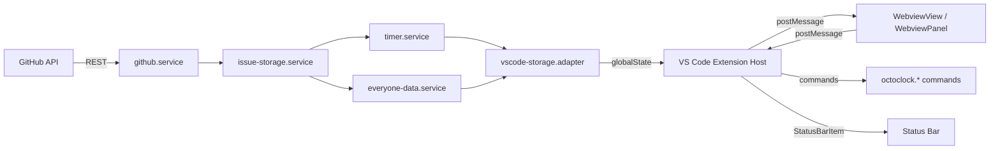
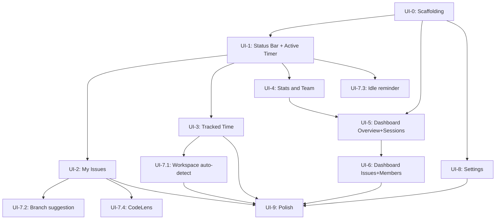
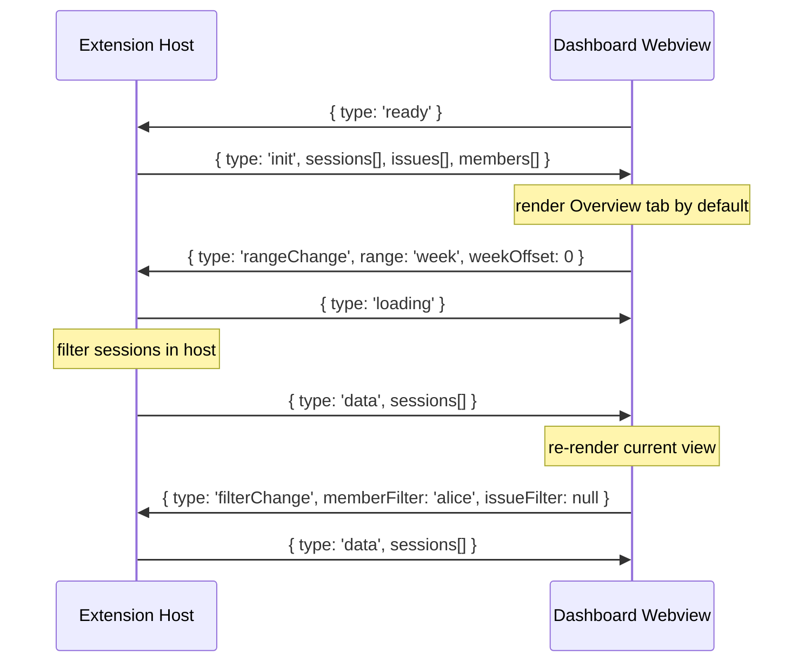
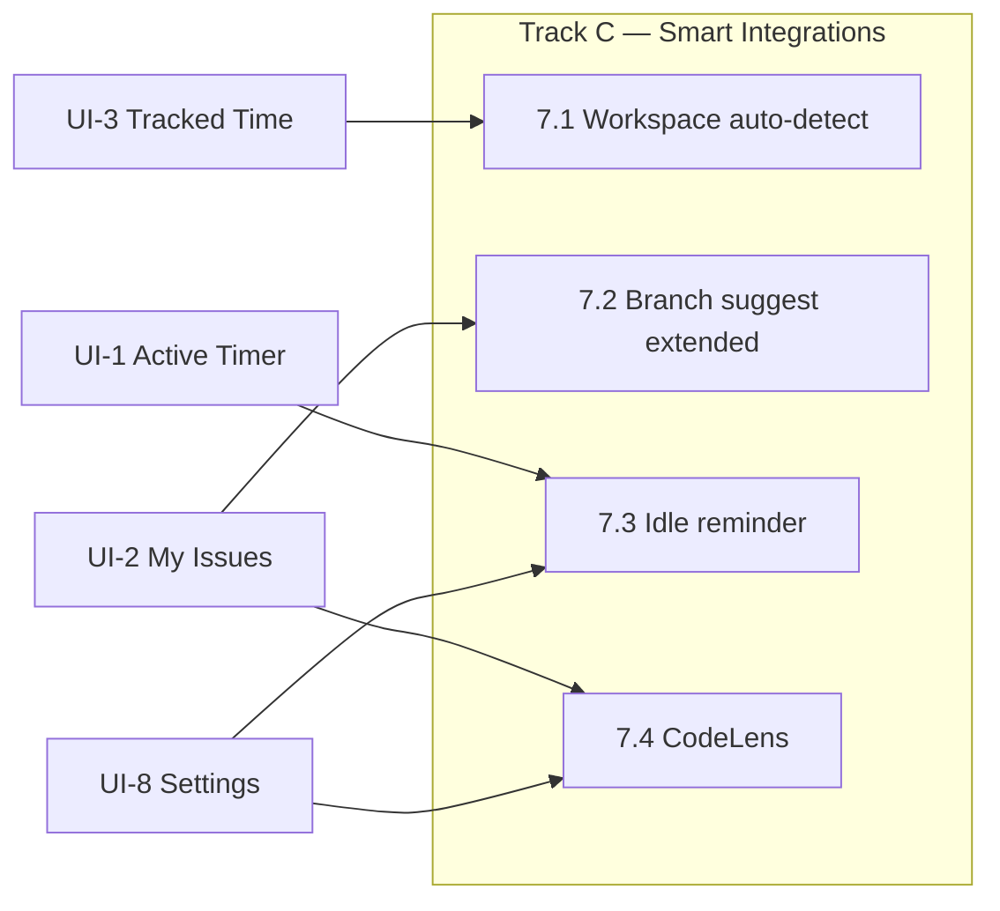

# VS Code Extension – UI Implementation Plan

## Purpose

This document translates the interactive HTML mockup at
[`packages/vscode-ext/ui/index.html`](../../packages/vscode-ext/ui/index.html)
and the UX vision from [`docs/vscode/vscode-ui-audit.md`](vscode-ui-audit.md) into a
concrete, milestone-by-milestone plan for building the **native VS Code extension UI**.

It is the **UI counterpart** to
[`docs/vscode/vscode-extension-migration-plan.md`](vscode-extension-migration-plan.md),
which covers the shared-core extraction. Both plans can run in parallel once Milestone M2
of the migration plan (monorepo scaffold) is complete.

> [!IMPORTANT]
> The HTML prototype at `packages/vscode-ext/ui/index.html` is the **single source of
> visual truth** for this plan. Every panel, interaction, animation, and data format
> described below maps directly to a section of that file. Line references are included
> in each milestone so you can open the file alongside this document and compare 1:1.

---

## Goal

Ship a VS Code extension sidebar that:

- **Matches the HTML prototype panel-for-panel** — Active Timer, My Issues, Tracked Time,
  Stats & Team, Settings (sidebar HTML: lines 1736–2000 in `index.html`)
- **Adds the full stats dashboard** as a native `WebviewPanel` in the editor area with all
  four views (Overview, Issues, Members, Sessions) and time-range filtering
  (dashboard HTML: lines 2100–2160; JS: lines 2439–2810 in `index.html`)
- **Integrates natively** with VS Code APIs — `TreeView`, `WebviewView`, `StatusBarItem`,
  commands, `vscode.workspace`, git extension API
- **Feels first-party** — no reused popup HTML; every surface is idiomatic VS Code

Success criteria: every interaction that works in `ui/index.html` must work identically
in the shipped extension, without any CDN dependency, hard-coded color, or CSP violation.

---

## Architecture overview

```
┌──────────────────────────────────────────────────────────────────────────────┐
│ VS Code Extension Host (Node.js)                                              │
│                                                                               │
│  extension.js (activate)                                                      │
│       │                                                                       │
│       ├── StatusBarController          → status bar item (always visible)    │
│       ├── ActiveTimerProvider          → WebviewView  (sidebar panel)        │
│       ├── MyIssuesProvider             → WebviewView  (sidebar panel)        │
│       ├── TrackedTimeProvider          → TreeDataProvider (sidebar panel)    │
│       ├── TeamStatsProvider            → WebviewView  (sidebar panel)        │
│       ├── SettingsProvider             → TreeDataProvider (sidebar panel)    │
│       └── DashboardPanel              → WebviewPanel (editor area tab)      │
│               │                                                               │
│               └── dist/webview/dashboard/   ← self-contained webview app    │
│                       index.html            (native equivalent of prototype) │
│                       app.js                (range picker, 4 views)          │
│                       style.css             (tokens.css + panel CSS)         │
│                                                                               │
│  packages/core/src/services/          (shared — zero VS Code API imports)    │
│       timer.service.js                                                        │
│       everyone-data.service.js                                                │
│       issue-storage.service.js                                                │
│       pinned-repos.service.js                                                 │
│       github.service.js                                                       │
│                                                                               │
│  packages/vscode-ext/src/adapters/                                           │
│       vscode-storage.adapter.js       (globalState / secretStorage)          │
│       vscode-messaging.adapter.js     (EventEmitter-based)                   │
│       vscode-storage-events.adapter.js                                        │
└──────────────────────────────────────────────────────────────────────────────┘
```

### How data flows

All business logic lives in `packages/core`. The extension host wires the core services to
VS Code APIs via adapters. WebviewViews and the WebviewPanel communicate with the host over
a `postMessage` bridge — they never import `vscode` or call storage APIs directly.



---

## Delivery strategy

Work in three parallel tracks:

| Track | Focus                                            | Can start when                   |
|-------|--------------------------------------------------|----------------------------------|
| **A** | Native sidebar panels (TreeViews + WebviewViews) | Migration plan M2 done           |
| **B** | Dashboard WebviewPanel                           | Any time — no sidebar dependency |
| **C** | Smart integrations (git, idle, CodeLens)         | Track A panels stable            |

Do not ship Track C until Track A panels are functionally complete. Track B can be
developed, demoed, and reviewed entirely independently.

---

## Milestones

| ID   | Name                                      | Track | Gate                                      |
|------|-------------------------------------------|-------|-------------------------------------------|
| UI-0 | Design tokens and dev scaffolding         | A+B   | —                                         |
| UI-1 | Status bar + Active Timer panel           | A     | Timer starts/stops                        |
| UI-2 | My Issues panel                           | A     | List renders, timer starts from row       |
| UI-3 | Tracked Time panel                        | A     | Tree renders, workspace filter works      |
| UI-4 | Stats & Team panel (compact sidebar)      | A     | Team rows visible, dashboard button works |
| UI-5 | Dashboard — Overview + Sessions           | B     | Range picker works end-to-end             |
| UI-6 | Dashboard — Issues + Members + drill-down | B     | All 4 views complete                      |
| UI-7 | Smart integrations                        | C     | Branch suggest + idle reminder            |
| UI-8 | Settings panel                            | A     | Toggles persist across reloads            |
| UI-9 | Polish and accessibility                  | A+B   | Passes VS Code extension review checklist |

### Dependency graph



> **Reading the graph:** an arrow A → B means B cannot start until A is done.
> Nodes with no incoming arrows (UI-0) can start immediately.

---

## Milestone UI-0 — Design tokens and dev scaffolding

### What and why

Before any UI code is written, establish the shared foundation:

- VS Code CSS variables that replace every hard-coded hex color in the prototype
- A CSP + nonce template so all webviews load without errors from day one
- A fast dev loop where changing a provider file triggers a hot rebuild in < 2 s

**Why first:** the HTML prototype uses hard-coded hex values throughout
(`index.html` lines 30–50: `--c-bg`, `--c-fg`, `--c-active: #4ec9b0`, etc.).
Every one of these must map to a `var(--vscode-*)` token before any webview surface
can be tested against Light themes or High Contrast mode. Establishing the token
file once prevents rework in every subsequent milestone.

### UI/UX reference

`index.html` lines 30–80 — CSS custom property block. These are the prototype's design
tokens. Each prototype variable maps to a VS Code semantic token in `tokens.css`.

### Tasks

**0.1 — CSS token file**

Create `packages/vscode-ext/src/webview/shared/tokens.css`:

```css
/* tokens.css — single source of truth for all webview surfaces.
   Each line maps a prototype variable (index.html lines 30-50) to a VS Code token. */
:root {
    --oc-bg:        var(--vscode-sideBar-background);               /* --c-bg */
    --oc-fg:        var(--vscode-foreground);                       /* --c-fg */
    --oc-desc:      var(--vscode-descriptionForeground);
    --oc-hover:     var(--vscode-list-hoverBackground);             /* --c-hover */
    --oc-sep:       var(--vscode-sideBar-border, rgba(255,255,255,.06));
    --oc-badge:     var(--vscode-badge-background, #007acc);
    --oc-active:    var(--vscode-terminal-ansiCyan, #4ec9b0);       /* --c-active */
    --oc-open:      var(--vscode-terminal-ansiGreen, #3fb950);      /* --c-open */
    --oc-branch:    var(--vscode-terminal-ansiMagenta, #c586c0);    /* --c-branch */
    --oc-stop:      var(--vscode-terminal-ansiRed, #f48771);
    --oc-font-ui:   var(--vscode-font-family);
    --oc-font-mono: var(--vscode-editor-font-family);
}
```

> [!WARNING]
> The fallback hex values are for edge-case themes that omit `terminal.ansi*` tokens.
> They must **never** appear without the `var(--vscode-*)` wrapper in shipped CSS.

**0.2 — CSP helper**

Create `packages/vscode-ext/src/webview/shared/csp.js`:

```js
export function getNonce() {
    let t = '';
    const c = 'ABCDEFGHIJKLMNOPQRSTUVWXYZabcdefghijklmnopqrstuvwxyz0123456789';
    for (let i = 0; i < 32; i++) t += c.charAt(Math.floor(Math.random() * c.length));
    return t;
}

export function buildCsp(webview, nonce) {
    return [
        `default-src 'none'`,
        `style-src ${webview.cspSource} 'nonce-${nonce}'`,
        `font-src ${webview.cspSource}`,   // codicons served locally (not CDN)
        `script-src 'nonce-${nonce}'`,
        `img-src ${webview.cspSource} https:`,
    ].join('; ');
}
```

The prototype loads codicons from a CDN (`index.html` line ~12). In the native extension,
copy font files from `node_modules/@vscode/codicons/dist/` into `dist/webview/fonts/`.

**0.3 — esbuild config**

Create `packages/vscode-ext/esbuild.mjs`:

```js
import esbuild from 'esbuild';
const watch = process.argv.includes('--watch');

// Extension host — must NOT bundle vscode
await esbuild.build({
    entryPoints: ['src/extension.js'],
    bundle: true, outfile: 'dist/extension.js',
    platform: 'node', target: 'node18',
    external: ['vscode'],          // marking vscode external prevents crash-on-load
    sourcemap: watch ? 'inline' : false, watch,
});

// Dashboard webview — isolated browser bundle
await esbuild.build({
    entryPoints: ['src/webview/dashboard/app.js'],
    bundle: true, outfile: 'dist/webview/dashboard/app.js',
    platform: 'browser', format: 'iife', watch,
});
```

**0.4 — Target folder structure**

```
packages/vscode-ext/
├── src/
│   ├── extension.js
│   ├── status-bar.js
│   ├── commands.js
│   ├── dashboard-panel.js
│   ├── providers/
│   │   ├── active-timer.provider.js    ← NEW (WebviewView)
│   │   ├── my-issues.provider.js       ← NEW (WebviewView)
│   │   ├── tracked-time.provider.js    ← NEW (TreeDataProvider)
│   │   ├── team-stats.provider.js      ← NEW (WebviewView)
│   │   └── settings.provider.js        ← NEW (TreeDataProvider)
│   └── webview/
│       ├── shared/
│       │   ├── tokens.css
│       │   ├── csp.js
│       │   └── components.js           ← shared HTML template functions
│       ├── active-timer/  (index.html + app.js)
│       ├── my-issues/     (index.html + app.js)
│       ├── team-stats/    (index.html + app.js)
│       └── dashboard/     (index.html + app.js + style.css)
└── dist/  (generated — not committed)
```

### Acceptance criteria

- `pnpm run dev` starts the extension host in watch mode.
- Changing any `src/` file triggers an incremental rebuild in < 2 s.
- A blank extension with a registered Activity Bar icon loads without console errors.
- No CSP errors in the webview developer console (`Help → Toggle Developer Tools`).
- Codicon font loads from `dist/webview/fonts/`, not from a CDN.

---

## Milestone UI-1 — Status bar + Active Timer panel

### What and why

The status bar is the **always-visible surface** of OctoClock — visible whether or not
the sidebar is open. Its running/idle state is the source of truth that drives every
subsequent panel.

The Active Timer panel is the **first thing users see** when they open the OctoClock
sidebar. Its pulsing dot and live counter signal at a glance whether a timer is running.

### UI/UX reference

- `index.html` line 2162: status bar simulation (`<div class="si">`)
- `index.html` lines 1736–1770: Active Timer panel HTML
- `index.html` line 1758: Stop button (`btn-stop`)
- `index.html` lines 1762–1764: idle row (`timer-idle-row`) shown when no timer is active
- `index.html` lines 2314–2335: `stopTimer()` + `startTick()` — JS state management

### Depends on

UI-0 (tokens + CSP)

### Tasks

**1.1 — Status bar item**

Refine `src/status-bar.js`:

```js
// Running (mirrors index.html line 2162):
item.text    = `$(clock) ${fmtShort(elapsed)} · #${issueId}`;
item.color   = new vscode.ThemeColor('terminal.ansiCyan');
item.tooltip = `Tracking #${issueId} · ${repoName}\nClick to open sidebar`;
item.command = 'octoclock.focusSidebar';

// Idle:
item.text    = `$(clock) OctoClock`;
item.color   = undefined;
```

Update every second via `setInterval` in the extension host. This is the **source of truth
tick** — webviews derive elapsed from the last pushed state, not from independent timers.

**1.2 — Active Timer WebviewView provider**

Create `src/providers/active-timer.provider.js`. Uses `WebviewView` (not `TreeView`) because
it needs a pulsing CSS animation, live `h:mm:ss`, and a styled Stop button.

```js
class ActiveTimerProvider {
    resolveWebviewView(webviewView) {
        this._view = webviewView;
        webviewView.webview.options = { enableScripts: true, localResourceRoots: [...] };
        webviewView.webview.html    = this._getHtml(webviewView.webview);
        this._sendState();
        webviewView.webview.onDidReceiveMessage(msg => {
            if (msg.type === 'stopTimer') vscode.commands.executeCommand('octoclock.stopTimer');
            if (msg.type === 'ready')     this._sendState();
        });
    }
    update(timerState) { this._view?.webview.postMessage({ type: 'state', ...timerState }); }
}
```

**1.3 — Message protocol**

```
Extension host → webview:
  { type: 'state', running: boolean, issueId: number|null, repo: string, elapsed: number }

Webview → extension host:
  { type: 'ready' }     ← sent on DOMContentLoaded
  { type: 'stopTimer' } ← sent when user clicks Stop button
```

The webview drives its own `setInterval` ticker once it receives the first state push,
so the counter stays smooth even if the host is briefly busy.

**1.4 — `package.json` view registration**

```json
{
    "viewsContainers": {
        "activitybar": [{ "id": "octoclock", "title": "OctoClock", "icon": "$(clock)" }]
    },
    "views": {
        "octoclock": [
            { "type": "webview", "id": "octoclock.activeTimer", "name": "Active Timer" }
        ]
    }
}
```

### Acceptance criteria

- Status bar shows `$(clock) 1h 23m · #42` when running; `$(clock) OctoClock` when idle.
- Active Timer panel renders: pulsing dot, repo › issue label, live `h:mm:ss`, Stop button
  — matching `index.html` lines 1736–1770.
- The idle row appears when no timer is active — matching `index.html` line 1762.
- Clicking Stop fires `octoclock.stopTimer`; panel transitions to idle immediately.
- Counter keeps ticking when the sidebar panel is collapsed or hidden.

---

## Milestone UI-2 — My Issues panel

### What and why

The My Issues panel is the **primary action surface** — users start timers here. It must
support the branch suggestion row, freeform search, status tab filter (Open/Closed/All),
and inline play buttons.

Filtering is **100% client-side** in the webview (no round-trips for search/tab changes).
The full issue list is pushed once from the extension host; all filter logic runs in the
webview JS with a 120 ms debounce.

### UI/UX reference

- `index.html` lines 1771–1810: My Issues section HTML
- `index.html` lines 1785–1794: branch suggestion row (`.branch-row`, `branch-track-btn`)
- `index.html` lines 2209–2260: `SIDEBAR_ISSUES` array — defines the data shape
- `index.html` lines 2380–2390: branch button state update in `renderIssueList()`
- `index.html` line 2221: `workspaceOnly` state flag

### Depends on

UI-1 (timer state needed so the Track button shows "Tracking" when that issue is active)

### Tasks

**2.1 — My Issues WebviewView provider**

Create `src/providers/my-issues.provider.js`. `WebviewView` required (not `TreeView`) for:
a free-text `<input>`, CSS tab buttons, and the dynamic branch suggestion row.

**2.2 — Data loading**

```js
async resolveWebviewView(webviewView) {
    const issues = await this._loadAllIssues();  // IssueStorageService
    webviewView.webview.postMessage({ type: 'issues', items: issues });

    vscode.workspace.onDidChangeWorkspaceFolders(async () => {
        const updated = await this._loadAllIssues();
        this._view?.webview.postMessage({ type: 'issues', items: updated });
    });
}
```

**2.3 — Branch suggestion (see also UI-7.2 for extended notification)**

```js
// Mirrors renderIssueList() branch logic at index.html lines 2380-2389
const git = vscode.extensions.getExtension('vscode.git')?.exports?.getAPI(1);
git?.repositories[0]?.state.onDidChange(() => {
    const branch = git.repositories[0].state.HEAD?.name ?? null;
    const match  = branch?.match(/\b(\d{2,6})\b/);
    if (match) this._view?.webview.postMessage({
        type: 'branchSuggestion', issueId: parseInt(match[1]), branch
    });
});
```

**2.4 — Message protocol**

```
Extension host → webview:
  { type: 'issues',           items: [{ id, title, status, repo, url }] }
  { type: 'timerState',       running: boolean, activeIssueId: number|null }
  { type: 'branchSuggestion', issueId: number, branch: string }

Webview → extension host:
  { type: 'ready' }
  { type: 'startTimer', issueId: number }
  { type: 'openUrl', url: string }
```

**2.5 — Client-side filtering**

```js
// In my-issues/app.js — never postMessage for search/tab filtering
let debounce;
searchInput.addEventListener('input', () => {
    clearTimeout(debounce);
    debounce = setTimeout(() => render(allIssues, searchInput.value, activeTab), 120);
});
```

### Acceptance criteria

- Issues list renders with correct open (teal) / closed (grey) icon colors.
- Search filters by title and `#id` with no network call.
- Open / Closed / All tabs filter correctly.
- Branch row appears when current branch contains a matching issue number — matching
  `index.html` lines 1785–1794.
- Track button on branch row shows "Tracking" when that issue's timer is active —
  matching `index.html` lines 2380–2384.
- Clicking ▶ fires `octoclock.startTimer`. Clicking ↗ opens the GitHub issue in browser.

---

## Milestone UI-3 — Tracked Time panel

### What and why

The Tracked Time panel shows every logged session grouped by repo → issue → session.
It is the only panel using a native `TreeDataProvider` because the three-level
expand/collapse tree is trivially correct in a `TreeView` and very complex in a webview.

The workspace filter chip in the prototype maps to a **tree view title action** icon.

### UI/UX reference

- `index.html` lines 1811–1878: Tracked Time section HTML
- `index.html` line 1865: `<!-- Repo 2 — hidden when workspace filter is on -->`
  This comment marks the exact behavior the workspace filter replicates
- `index.html` lines 2390–2395: `toggleWorkspace()` function

### Depends on

UI-1 (timer start/stop triggers `refresh()`)

### Tasks

**3.1 — TrackedTimeProvider**

```js
class TrackedTimeProvider {
    _onDidChangeTreeData = new vscode.EventEmitter();
    onDidChangeTreeData  = this._onDidChangeTreeData.event;

    getChildren(element) {
        if (!element)              return this._getRepoNodes();
        if (element.type === 'repo')   return this._getIssueNodes(element.repo);
        if (element.type === 'issue')  return this._getSessionNodes(element);
    }
    refresh() { this._onDidChangeTreeData.fire(); }
}
```

Node `contextValue` values drive `when` clauses for inline actions:

| Level          | `contextValue`    | Icon              | Description field |
|----------------|-------------------|-------------------|-------------------|
| Repo           | `oc-repo`         | `$(repo)`         | `3h 12m`          |
| Issue (active) | `oc-issue-active` | `$(clock)` (teal) | `1h 23m`          |
| Issue (idle)   | `oc-issue`        | `$(history)`      | `1h 49m`          |
| Session        | `oc-session`      | `$(history)`      | `45 min`          |

**3.2 — Workspace filter (mirrors `index.html` line 2221 `workspaceOnly` flag)**

```json
{
    "view/title": [{
        "command": "octoclock.toggleWorkspaceFilter",
        "when": "view == octoclock.trackedTime",
        "group": "navigation"
    }]
}
```

Filter on → `$(folder)` icon in `--oc-active` color. Filter off → `$(folder-opened)`.
Store preference in `context.globalState`.

**3.3 — Inline actions**

```json
{
    "view/item/context": [
        { "command": "octoclock.stopTimer",    "when": "viewItem == oc-issue-active", "group": "inline" },
        { "command": "octoclock.startTimer",   "when": "viewItem == oc-issue",        "group": "inline" },
        { "command": "octoclock.editSession",  "when": "viewItem == oc-session",      "group": "inline" },
        { "command": "octoclock.deleteSession","when": "viewItem == oc-session",      "group": "inline" }
    ]
}
```

**3.4 — Refresh triggers**

Call `provider.refresh()` from: `startTimer`, `stopTimer`, `editSession`, `deleteSession`,
`octoclock.refreshAll`, and on extension activation.

### Acceptance criteria

- All three tree levels expand/collapse correctly.
- Active issue: `$(clock)` teal icon + `[■ Stop]` inline action.
- Idle issue: `$(history)` + `[▶]` + `[🗑]` inline actions.
- Session nodes: date + duration + `[✎]` + `[🗑]`.
- Workspace filter hides repos not matching the current workspace git remotes.
- Tree auto-refreshes after any timer start/stop/edit.

---

## Milestone UI-4 — Stats & Team panel (compact sidebar)

### What and why

The compact Stats & Team panel is the **gateway to the full dashboard**. It shows the most
important KPIs, a mini issue bar chart, and team activity rows. The "Full dashboard →"
button opens the `WebviewPanel` from UI-5.

Uses `WebviewView` (not `TreeView`) because CSS bar charts and avatar initials are not
expressible in `TreeItem`.

### UI/UX reference

- `index.html` lines 1880–1948: Stats & Team section HTML
- `index.html` lines 2511–2602: `renderOverview()` — the data structure this panel mirrors
  (same KPI cards, issue bars, team rows — just smaller)
- `index.html` lines 1943–1948: Full Dashboard button

### Depends on

UI-1 (timer stop updates "your time today"); UI-3 (repo list); UI-5 must be planned in
parallel (the button is a stub calling `octoclock.openDashboard` until UI-5 ships).

### Tasks

**4.1 — Data push**

```js
async _sendStats() {
    const everyoneData = await everyoneDataService.get();
    const myTime       = await timerService.getTodayTotal();
    this._view?.webview.postMessage({ type: 'stats', everyoneData, myTime });
}
```

**4.2 — Full Dashboard button message**

```js
webviewView.webview.onDidReceiveMessage(msg => {
    if (msg.type === 'openDashboard')
        vscode.commands.executeCommand('octoclock.openDashboard');
});
```

**4.3 — Auto-refresh schedule**

| Trigger                                | Action              |
|----------------------------------------|---------------------|
| `octoclock.stopTimer`                  | call `_sendStats()` |
| `octoclock.syncTeamData` completes     | call `_sendStats()` |
| `webviewView.visible` && 5 min elapsed | call `_sendStats()` |

### Acceptance criteria

- KPI cards: your time today + team time this week with correct values.
- Issue bars proportional to the max-time issue.
- Team rows: avatar initials, name, last issue, time, recency label.
- "Full dashboard →" opens the Dashboard panel (or reveals it if already open).
- Panel updates automatically after timer stop or team sync.

---

## Milestone UI-5 — Dashboard — Overview + Sessions

### What and why

The Dashboard is a `WebviewPanel` opened in the **editor area** — the native equivalent of
the dashboard section in the HTML prototype. UI-5 ships Overview and Sessions; UI-6 adds
Issues and Members.

**Key architectural decision:** data is filtered in the **extension host**, not the webview.
The webview sends range/filter parameters; the host returns pre-filtered session arrays.
This keeps business logic out of the webview.

> [!NOTE]
> In the prototype, `sessionsInRange()` (line 2281) runs in the browser for convenience.
> In the native extension this function moves to the extension host. The webview only
> renders the data it receives.

### UI/UX reference

- `index.html` lines 2100–2160: dashboard HTML shell (left nav rail, repo selector, tab bar)
- `index.html` lines 2120–2140: four tab buttons (Overview / Issues / Members / Sessions)
- `index.html` lines 2439–2470: `setDashRange()` + week offset navigation
- `index.html` lines 2491–2510: `renderDashboard()` topbar (range pills + ← → week nav)
- `index.html` lines 2511–2602: `renderOverview()` — KPI cards, bar chart, issue list, team
- `index.html` lines 2753–2810: `renderSessions()` — date-grouped log + dropdowns

### Depends on

UI-4 (the "Full dashboard →" button triggers `octoclock.openDashboard`); UI-0 (CSP)

### Data flow



### Tasks

**5.1 — DashboardPanel class**

Create `src/dashboard-panel.js`:

```js
class DashboardPanel {
    static currentPanel = null;

    static open(extensionUri, services) {
        if (DashboardPanel.currentPanel) { DashboardPanel.currentPanel._panel.reveal(); return; }
        const panel = vscode.window.createWebviewPanel(
            'octoclock.dashboard', 'OctoClock Stats', vscode.ViewColumn.One,
            {
                enableScripts: true,
                localResourceRoots: [vscode.Uri.joinPath(extensionUri, 'dist', 'webview')],
                retainContextWhenHidden: true,  // keeps webview alive on tab switch (see UI-6.4)
            }
        );
        DashboardPanel.currentPanel = new DashboardPanel(panel, extensionUri, services);
    }

    async _handleMessage(msg) {
        if (msg.type === 'ready')        return this._sendInit();
        if (msg.type === 'rangeChange')  return this._sendFiltered(msg);
        if (msg.type === 'filterChange') return this._sendFiltered(msg);
        if (msg.type === 'memberDrill')  return this._sendMemberDetail(msg);  // UI-6
    }
}
```

**5.2 — Webview app module structure**

```
dashboard/
  state.js        — range, weekOffset, activeView, dashMember, filters
  data.js         — postMessage bridge, data cache, notify listeners
  render.js       — top-level router (delegates to view renderers)
  views/
    overview.js   — mirrors renderOverview() from index.html line 2511
    sessions.js   — mirrors renderSessions() from index.html line 2753
    issues.js     — mirrors renderIssues()   from index.html line 2604  (UI-6)
    members.js    — mirrors renderMembers()  from index.html line 2661  (UI-6)
  components/
    kpiCard.js, barChart.js, topbar.js (range picker + week nav)
```

**5.3 — Range picker**

The prototype renders four pills + ← → arrows (lines 2491–2510). In the native extension,
clicking a pill sends `{ type: 'rangeChange', range, weekOffset }` to the host instead of
calling `sessionsInRange()` locally.

### Acceptance criteria

- `octoclock.openDashboard` opens the panel; second call reveals the existing tab.
- Overview: KPI cards, daily bar chart, issue list, team leaderboard.
- Range pills (Today/Week/Month/All Time) trigger host-side re-fetch.
- Week navigation ← → works; future weeks disabled.
- Sessions: groups by date; member + issue filter dropdowns trigger host-side re-fetch.
- `retainContextWhenHidden` keeps state (active tab, range, scroll) across tab switches.

---

## Milestone UI-6 — Dashboard — Issues + Members + drill-down

### What and why

Complete the dashboard with the Issues and Members views, including the member drill-down —
a full sub-navigation within the panel where clicking a member card enters a detail view
and the back button returns to the grid.

### UI/UX reference

- `index.html` lines 2604–2660: `renderIssues()` — expandable row per issue
- `index.html` line 2657: `dashIssueOpen` expand/collapse toggle logic
- `index.html` lines 2661–2755: `renderMembers()` — card grid (2-col CSS Grid)
- `index.html` lines 2694–2756: member drill-down sub-view (KPIs + session log)
- `index.html` lines 2735–2736: back button resets `state.dashMember = null`
- `index.html` line 2742: `kpiCard(sess.length, 'Sessions', ...)` in drill-down

### Depends on

UI-5 (DashboardPanel, message protocol, `state.js`, `data.js`, `render.js`)

### Tasks

**6.1 — Issues view**

```js
// Host computes aggregates and sends:
{ type: 'issueStats', items: [{ id, title, status, totalMin, sessions, byMember }] }
```

Expand/collapse state (`dashIssueOpen` from prototype line 2657) is **local to the webview**
— no host round-trip needed since `retainContextWhenHidden` preserves it.

**6.2 — Members card grid**

```js
// Host sends:
{ type: 'memberStats', items: [{ id, name, initials, color, totalMin, sessions, issues }] }
```

Cards use `CSS Grid: repeat(2, 1fr)` matching the prototype layout.

**6.3 — Member drill-down message protocol**

```
Webview → host:  { type: 'memberDrill', memberId: string }
Host → webview:  { type: 'memberDetail', member, totalMin, sessions, issueStats, sessionLog }
```

The back button sets `state.dashMember = null` and calls `renderDashboard()` locally —
matching prototype line 2735.

**6.4 — Navigation state persistence**

`retainContextWhenHidden: true` (set in UI-5.1) keeps the webview alive when hidden.
Store navigation state in `window._ocState`:

```js
window._ocState = {
    activeView: 'members',   // overview | issues | members | sessions
    dashMember: 'alice',     // null = card grid, string = drill-down view
    range:      'week',
    weekOffset: 0,
    scrollY:    412,
};
```

### Acceptance criteria

- Issues view: correct totals + status icons. Clicking a row expands per-contributor breakdown.
- Members view: 2-column card grid. Each card: total time in member color, session count, issue count.
- Clicking a card enters the member detail view.
- Member detail: 4 KPI cards, issue breakdown, chronological session log — matching
  `index.html` lines 2694–2756.
- Back button returns to card grid with scroll position restored.
- All four views work at every range setting.

---

## Milestone UI-7 — Smart integrations

### What and why

Smart integrations turn OctoClock from a manual timer into a context-aware assistant.
Each feature is independent; ship them one at a time after Track A is stable.



### Feature 7.1 — Auto-detect workspace repositories

**Trigger:** `vscode.workspace.onDidChangeWorkspaceFolders` + on activation.

**No prototype equivalent** — this is a VS Code notification banner. The workspace filter
in Tracked Time (UI-3) is the downstream UI that benefits.

```js
async function detectWorkspaceRepos(context) {
    const git      = vscode.extensions.getExtension('vscode.git')?.exports?.getAPI(1);
    if (!git) return;
    const dismissed = context.globalState.get('oc.dismissedRepos', []);

    for (const repo of git.repositories) {
        const url   = repo.state.remotes.find(r => r.name === 'origin')?.fetchUrl ?? '';
        const match = url.match(/github\.com[:/]([^/]+\/[^/.]+)/);
        if (!match) continue;
        const name = match[1].replace(/\.git$/, '');
        if (await pinnedReposService.isPinned(name) || dismissed.includes(name)) continue;

        const action = await vscode.window.showInformationMessage(
            `OctoClock detected: ${name}`, 'Pin & Track', 'Dismiss'
        );
        if (action === 'Pin & Track') {
            await pinnedReposService.pin(name);
            vscode.commands.executeCommand('octoclock.refreshAll');
        } else {
            await context.globalState.update('oc.dismissedRepos', [...dismissed, name]);
        }
    }
}
```

**Acceptance criteria:**
- Info message appears once per unrecognized GitHub repo.
- "Pin & Track" pins the repo and refreshes all tree views.
- Dismissal stored in `globalState`; never re-shown for dismissed repos.

---

### Feature 7.2 — Branch → issue suggestion (extended)

**Trigger:** `git.repositories[0].state.onDidChange`

**UI/UX reference:**
- `index.html` lines 1785–1794: branch suggestion row (primary surface; implemented in UI-2)
- `index.html` lines 2380–2389: branch button active-state update

Feature 7.2 adds a supplementary **one-time status bar notification** on first branch match:

```
OctoClock: Branch fix/42-login-redirect matches #42.  [Start timer]  [Ignore]
```

Auto-dismisses after 30 s. "Ignore" stores the branch name in `globalState` so it never
re-shows.

**Depends on:** UI-2 (branch row is already wired)

**Acceptance criteria:**
- Branch row in My Issues updates within 2 s of a HEAD change.
- Status bar notification appears once per unique branch name across sessions.
- "Start timer" starts the timer. "Ignore" persists the dismissal.

---

### Feature 7.3 — Idle reminder

**Trigger:** Timer running + no file save/change for N minutes (default: 30).

**UI/UX reference:** `index.html` lines 2148–2155: idle toast overlay with "Start timer"
and "Dismiss" buttons. In VS Code this maps to `showWarningMessage` (no custom UI needed).

```js
function startIdleWatcher(timerService, config) {
    let idleTimeout = null;

    const reset = () => { clearTimeout(idleTimeout); if (timerService.isRunning()) arm(); };
    const arm   = () => {
        const ms = config.get('idleReminderMinutes', 30) * 60_000;
        idleTimeout = setTimeout(async () => {
            const action = await vscode.window.showWarningMessage(
                `OctoClock: Timer running for ${fmtShort(timerService.elapsed())} — still working on #${timerService.activeIssueId}?`,
                'Yes, keep going', 'Stop timer'
            );
            if (action === 'Stop timer') vscode.commands.executeCommand('octoclock.stopTimer');
            else arm();  // re-arm
        }, ms);
    };

    vscode.workspace.onDidSaveTextDocument(reset);
    vscode.workspace.onDidChangeTextDocument(reset);
}
```

**Depends on:** UI-1 (timer events), UI-8 (idle reminder toggle)

**Acceptance criteria:**
- Warning appears after configured idle period.
- "Yes, keep going" re-arms the watcher. "Stop timer" stops and disarms.
- Watcher arms on `startTimer`, disarms on `stopTimer`.
- `octoclock.idleReminderMinutes` setting controls the interval.

---

### Feature 7.4 — CodeLens on issue references

**Trigger:** Any source file containing `#42`-style references.

**No prototype equivalent** — pure VS Code API feature.

```js
class OctoClockCodeLensProvider {
    constructor(issueStorageService) {
        this._issueIds = new Set();
        issueStorageService.onDidChange(ids => { this._issueIds = new Set(ids); });
    }
    provideCodeLenses(document) {
        const lenses = [], re = /#(\d{2,6})\b/g;
        for (let line = 0; line < document.lineCount; line++) {
            const text = document.lineAt(line).text;
            let m;
            while ((m = re.exec(text)) !== null) {
                const id = parseInt(m[1]);
                if (!this._issueIds.has(id)) continue;
                lenses.push(new vscode.CodeLens(
                    new vscode.Range(line, m.index, line, m.index + m[0].length),
                    { title: `⏱ Track #${id}`, command: 'octoclock.startTimer', arguments: [id] }
                ));
            }
        }
        return lenses;
    }
}
```

Register with `vscode.languages.registerCodeLensProvider({ scheme: 'file' }, provider)`.
Controlled by `octoclock.enableCodeLens` setting.

**Depends on:** UI-2 (issue list to validate IDs), UI-8 (`enableCodeLens` toggle)

**Acceptance criteria:**
- `⏱ Track #42` CodeLens appears for known issue IDs only.
- Clicking starts the timer.
- Disabling `octoclock.enableCodeLens` removes all lenses without reloading.

---

## Milestone UI-8 — Settings panel

### What and why

The Settings panel lets users configure the extension without touching VS Code's `settings.json`.
Uses `TreeDataProvider` because every row is a label + value + action — exactly what
`TreeItem` is designed for.

GitHub token is stored in `vscode.SecretStorage` — never in `globalState` or plain files.

### UI/UX reference

- `index.html` lines 1949–2000: Settings section (collapsed by default — matches VS Code
  tree default collapsed state)
- `index.html` lines 1967–1971: idle reminder toggle row with `toggle-idle` div
- `index.html` line 1953: closed chevron → this panel starts collapsed

### Depends on

UI-0 (scaffolding), UI-7.3 (idle watcher reacts to the idle toggle immediately)

### Tasks

**8.1 — Settings TreeDataProvider**

```js
class SettingsProvider {
    getChildren() {
        return [
            this._tokenNode(),
            this._toggleNode('Auto-sync',     'octoclock.autoSync',            'sync'),
            this._toggleNode('Idle reminder', 'octoclock.idleReminderMinutes',  'bell'),
            this._syncNowNode(),
        ];
    }

    _toggleNode(label, key, icon) {
        const val  = vscode.workspace.getConfiguration('octoclock').get(key);
        const item = new vscode.TreeItem(label, vscode.TreeItemCollapsibleState.None);
        item.description  = val ? '● On' : '○ Off';
        item.iconPath     = new vscode.ThemeIcon(icon);
        item.command      = { command: 'octoclock.toggleSetting', arguments: [key], title: '' };
        return item;
    }
}
```

**8.2 — GitHub Token command**

```js
vscode.commands.registerCommand('octoclock.configureToken', async () => {
    const token = await vscode.window.showInputBox({
        prompt: 'Enter your GitHub Personal Access Token',
        password: true, placeHolder: 'ghp_...',
        validateInput: v => (v.startsWith('ghp_') || v.startsWith('github_pat_'))
            ? null : 'Token must start with ghp_ or github_pat_',
    });
    if (token) { await context.secrets.store('octoclock.githubToken', token); settingsProvider.refresh(); }
});
```

### Acceptance criteria

- Token node shows "✓ Configured" / "✗ Not set" based on `SecretStorage`.
- Clicking token node opens a password input box.
- Token stored **only** in `vscode.SecretStorage`.
- Toggle nodes write to `workspace.getConfiguration` in global scope.
- Idle reminder toggle arms/disarms the idle watcher (Feature 7.3) immediately.
- "Sync now" shows `vscode.window.withProgress(...)` and refreshes the Stats panel.
- All settings survive extension reload and VS Code restart.

---

## Milestone UI-9 — Polish and accessibility

### What and why

Hardening pass before Marketplace submission. No new features.

### Tasks

**9.1 — Keyboard navigation**

Every WebviewView fully keyboard-navigable: `Tab`/`Shift+Tab`, `Enter`, `Escape`, arrow keys.

**9.2 — Theme compatibility matrix**

| Theme               | Required                     |
|---------------------|------------------------------|
| Dark+               | ✓                            |
| Light+              | ✓                            |
| High Contrast Dark  | ✓                            |
| High Contrast Light | ✓                            |
| Solarized Dark      | ✓ (popular; worth verifying) |

No hard-coded hex in any shipped CSS — all colors from `tokens.css`.

**9.3 — Screen reader support**

- Every interactive element: `aria-label`.
- Timer state changes: `aria-live="polite"` region.
- Bar chart bars: `aria-label="Monday: 2h 15m"`.

**9.4 — Marketplace metadata checklist**

- [ ] `README.md`: feature overview + animated GIFs + getting-started
- [ ] `CHANGELOG.md`: v1.0.0 entry
- [ ] Extension icon: 128×128 px SVG (monochromatic)
- [ ] `package.json` categories: `["Other", "Visualization"]`
- [ ] `"publisher"` and `"repository"` fields set

**9.5 — Bundle size gate**

`vsce ls` → package under **5 MB**. Verify esbuild does not accidentally include
`node_modules` in the webview bundle.

### Acceptance criteria

- `vsce package` with zero warnings.
- All webview surfaces keyboard-navigable.
- No hard-coded hex in any shipped CSS.
- Works in Light+, Dark+, High Contrast Dark, High Contrast Light.
- Package under 5 MB.
- `README.md` includes animated GIFs for: timer start, dashboard, branch suggestion.

---

## Shared component registry

Extract into `src/webview/shared/components.js` (template-literal functions → HTML strings):

| Function                      | Used by                                        |
|-------------------------------|------------------------------------------------|
| `kpiCard(val, label, delta)`  | Stats & Team (UI-4), Dashboard Overview (UI-5) |
| `barChart(items, maxVal)`     | Stats & Team (UI-4), Dashboard Overview (UI-5) |
| `issueRow(issue, timerState)` | My Issues (UI-2), Dashboard Issues (UI-6)      |
| `sessionRow(session)`         | Dashboard Sessions (UI-5)                      |
| `avatar(member)`              | Stats & Team (UI-4), Dashboard Members (UI-6)  |
| `rangePickerHtml(state)`      | Dashboard — all 4 views topbar (UI-5, UI-6)    |
| `loadingSkeleton(rows)`       | All WebviewViews while data loads              |

---

## VS Code configuration schema

```json
{
    "configuration": {
        "title": "OctoClock",
        "properties": {
            "octoclock.autoSync": {
                "type": "boolean", "default": true,
                "description": "Sync issues from GitHub when opening a pinned repo."
            },
            "octoclock.idleReminderMinutes": {
                "type": "number", "default": 30, "minimum": 5, "maximum": 480,
                "description": "Minutes of inactivity before the idle reminder fires while a timer is running."
            },
            "octoclock.enableCodeLens": {
                "type": "boolean", "default": true,
                "description": "Show '⏱ Track #N' CodeLens above issue references in source files."
            },
            "octoclock.workspaceFilterDefault": {
                "type": "boolean", "default": true,
                "description": "Filter Tracked Time tree to repos in the current workspace by default."
            }
        }
    }
}
```

---

## Commands registry

| Command                           | Title                              | Registered in |
|-----------------------------------|------------------------------------|---------------|
| `octoclock.startTimer`            | OctoClock: Start Timer             | UI-1          |
| `octoclock.stopTimer`             | OctoClock: Stop Timer              | UI-1          |
| `octoclock.focusSidebar`          | OctoClock: Focus Sidebar           | UI-1          |
| `octoclock.openDashboard`         | OctoClock: Open Dashboard          | UI-5          |
| `octoclock.syncTeamData`          | OctoClock: Sync Team Data          | UI-4          |
| `octoclock.configureToken`        | OctoClock: Configure GitHub Token  | UI-8          |
| `octoclock.pinRepo`               | OctoClock: Pin Repository          | UI-3          |
| `octoclock.unpinRepo`             | OctoClock: Unpin Repository        | UI-3          |
| `octoclock.toggleWorkspaceFilter` | OctoClock: Toggle Workspace Filter | UI-3          |
| `octoclock.toggleSetting`         | OctoClock: Toggle Setting          | UI-8          |
| `octoclock.editSession`           | OctoClock: Edit Session            | UI-3          |
| `octoclock.deleteSession`         | OctoClock: Delete Session          | UI-3          |
| `octoclock.refreshAll`            | OctoClock: Refresh All             | UI-1          |

---

## Plan soundness review

### What holds up well

- **Three-track delivery** (A sidebar / B dashboard / C smart) is sound. Track B has zero
  dependency on Track A, which lets the full dashboard be built and reviewed by a separate
  person or in a separate sprint.
- **WebviewView vs TreeDataProvider choice** is correct per surface: WebviewViews for panels
  needing animation, freeform input, or CSS layout; TreeDataProvider for pure
  list-with-actions surfaces.
- **Extension host as data gateway** (webview never calls storage or GitHub directly) is the
  right architecture for testability and CSP compliance.
- **`retainContextWhenHidden`** is the correct solution for dashboard navigation state.
  The trade-off (memory) is noted in the risk register.
- **`vscode.SecretStorage`** for the GitHub token is mandatory for Marketplace approval.
  Any other storage would be a blocker.

### Gaps and corrections

| # | Issue                                                                                                                                           | Correction in this document                                                                                                            |
|---|-------------------------------------------------------------------------------------------------------------------------------------------------|----------------------------------------------------------------------------------------------------------------------------------------|
| 1 | Branch suggestion in UI-2 only reacts to HEAD changes; VS Code opens with the branch already set and no change event fires                      | On `resolveWebviewView`, immediately read the current branch and send `branchSuggestion` if a match exists — not only on `onDidChange` |
| 2 | `octoclock.startTimer` needs to accept an `issueId` argument (from CodeLens and from tree inline actions)                                       | Command registered as `registerCommand('octoclock.startTimer', (issueId?) => ...)` — `issueId` may be undefined (opens a picker)       |
| 3 | `TrackedTimeProvider` has no session editing UI — `editSession` fires a command but there is no input surface                                   | `editSession` opens a `showInputBox` for the duration, or a QuickPick for start/end times. This is acceptable for v1.                  |
| 4 | Dashboard `retainContextWhenHidden` keeps the webview alive indefinitely                                                                        | The panel's `onDidDispose` already nulls `currentPanel`. If RAM is a concern, add an explicit "close" button in the dashboard UI.      |
| 5 | Feature 7.2 (branch notification) stores dismissed branches in `globalState` using branch names as keys — branch names can collide across repos | Key as `${repoName}/${branchName}` instead of just the branch name                                                                     |
| 6 | No mention of the `octoclock.pinRepo` command's UI entry point                                                                                  | It should appear in the Tracked Time panel's `view/title` context menu and in a Command Palette entry                                  |
| 7 | UI-4 "5 minute auto-refresh" will fire even if the panel is not visible                                                                         | Guard: `if (!this._view.visible) return;` already noted in task 4.3 — confirmed correct                                                |

---

## Risk register

| Risk                                                        | Likelihood | Impact                                | Mitigation                                                                     |
|-------------------------------------------------------------|------------|---------------------------------------|--------------------------------------------------------------------------------|
| VS Code git API unavailable (no `vscode.git` extension)     | Medium     | UI-2, UI-7.1, UI-7.2 silently degrade | Guard every git call with `?.`; branch row simply hides                        |
| WebviewView CSP blocks inline styles or scripts             | High       | All panels blank                      | Use nonce from UI-0.2; never use `style=""` in webview JS                      |
| `retainContextWhenHidden` increases memory                  | Low        | Dashboard tab eats RAM                | Document trade-off; add explicit "close" button                                |
| Hard-coded hex breaks Light / High Contrast themes          | High       | Accessibility complaint               | Token-only CSS from UI-0; Light theme test in CI                               |
| esbuild bundles `vscode` module                             | High       | Extension crashes on load             | `external: ['vscode']` in esbuild; caught by `vsce package`                    |
| GitHub API rate limits during team sync                     | Low        | Stats panel stale                     | Cache with TTL; show "last synced X min ago"                                   |
| Old `chrome.storage` keys conflict with `globalState` keys  | Medium     | Data loss on first launch             | Key-migration check in `activate()` before any reads                           |
| Multiple simultaneous VS Code notifications (idle + branch) | Low        | UX clutter                            | One active OctoClock notification at a time — discard stale if a new one fires |
